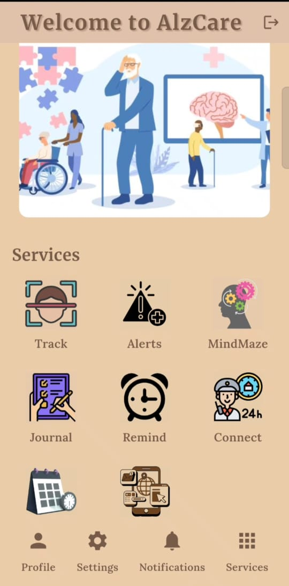
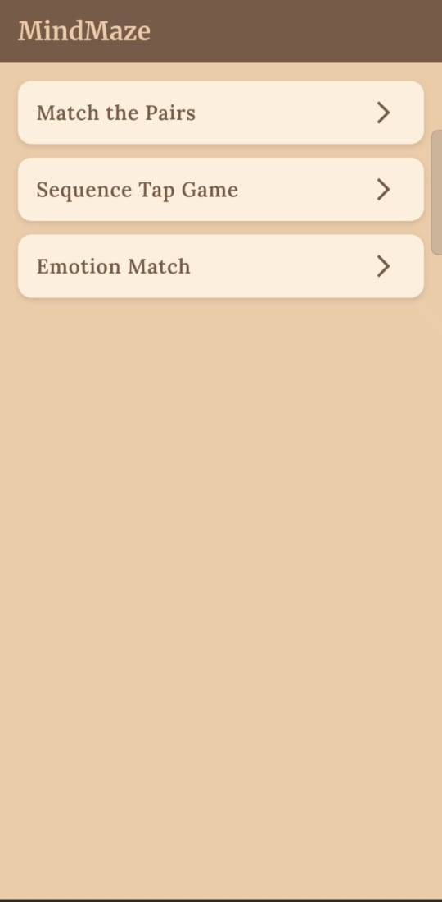
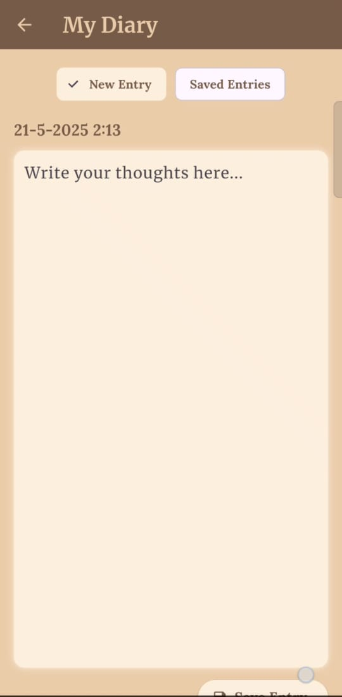
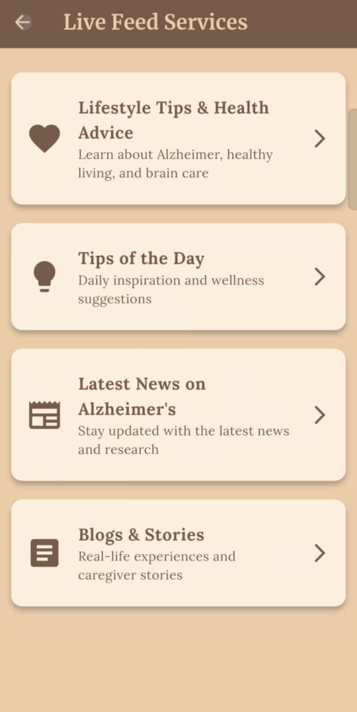
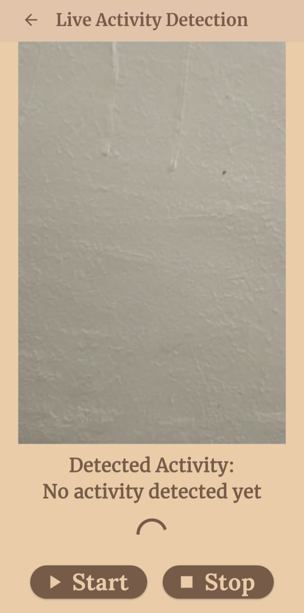

# AlzCare Frontend

AlzCare is a **smart assistance app for Alzheimer’s patients**, designed to provide real-time monitoring, cognitive exercises, daily activity tracking, and caregiver alerts. .
This repository contains the **Flutter Frontend**, along with a link to the backend used for monitoring and alerts.
👉 **Backend Repository:**  
https://github.com/riyakansal04/AlzCare
---

## 📌 Project Overview

| Area | Details |
|------|--------|
| **Platform** | Flutter (Android/iOS) |
| **Backend** | Python + Flask |
| **AI Model** | CNN-LSTM + MediaPipe |
| **Goal** | Safety, cognitive support, real-time alerts |

The app connects with the backend to detect anomalies and notify caregivers instantly.

---

## ✨ Key Features

### 📱 Flutter Frontend

- 🔔 Real-time alert notifications  
- 🧩 MindMaze — cognitive games  
- 📓 Journal — write daily thoughts & moods  
- 📰 Live Feed — health tips & motivation  
- 👤 Profile & medical information  
- 📅 Event tracker & reminders  

### 🧠 AI + Backend

- 👀 Activity tracking using **MediaPipe Pose**
- 🧠 CNN-LSTM activity classification
- 🚨 Fall & abnormal inactivity detection
- 🎥 Flask live video streaming
- 📡 Alerts via UI popups / email / SMS

Backend: https://github.com/riyakansal04/AlzCare

---

## 🏗️ Tech Stack

| Component | Technology |
|-----------|------------|
| Mobile UI | Flutter (Dart) |
| Backend API | Flask (Python) |
| AI Model | TensorFlow / Keras |
| Pose Estimation | MediaPipe |
| Streaming | OpenCV |
| Alerts | SMTP / Twilio |

---

## Screenshots

<table>
  <tr>
    <td></td>
    <td></td>
    <td></td>
  </tr>
  <tr>
    <td></td>
    <td></td>
  </tr>
</table>

---

## **Demo Video**

Watch the AlzCare app in action:  

[](./demo%20video%20(AlzCare).mp4)

---

## **Installation**

1. Clone this repository:
   ```bash
   git clone <frontend-repo-url>
   cd AlzCare-frontend

2. Install dependencies:
   ```bash
   flutter pub get

3. Run the app:
   ```bash
   flutter run

4. Make sure the backend is running and configured to connect with the app.

---

## Contributing
We welcome contributions to improve AlzCare’s frontend, including:
1. Enhancing UI/UX
2. Adding new features
3. Bug fixes and optimizations

Please create a pull request or open an issue for collaboration.

---

AlzCare ensures safety, support, and peace of mind for Alzheimer’s patients and their caregivers by combining cutting-edge AI with user-friendly mobile integration.

**Team AlzCare** | Authors: Riya Kansal [LinkedIn](https://www.linkedin.com/in/riya-kansal-963042268/) • [GitHub](https://github.com/riyakansal04)

– Committed to enhancing safety and care for Alzheimer’s patients.
